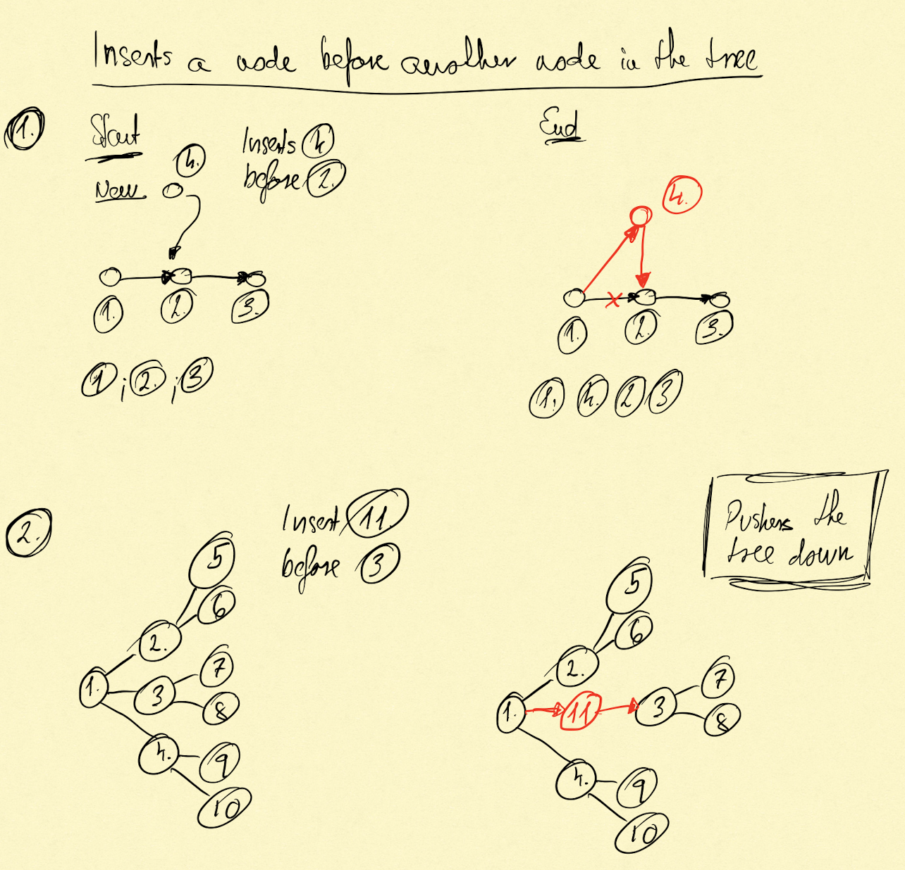
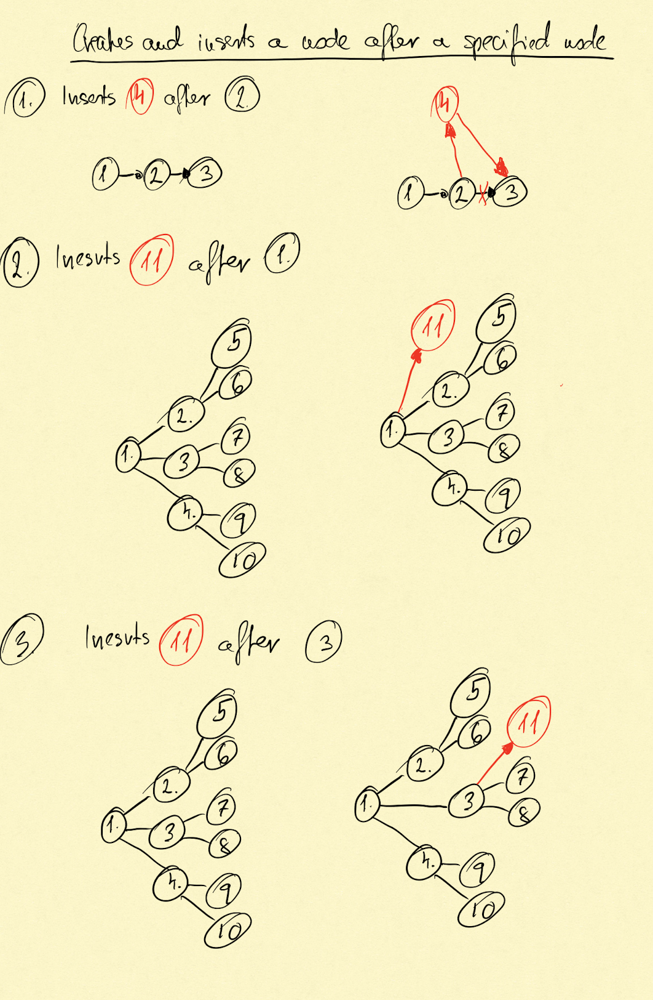
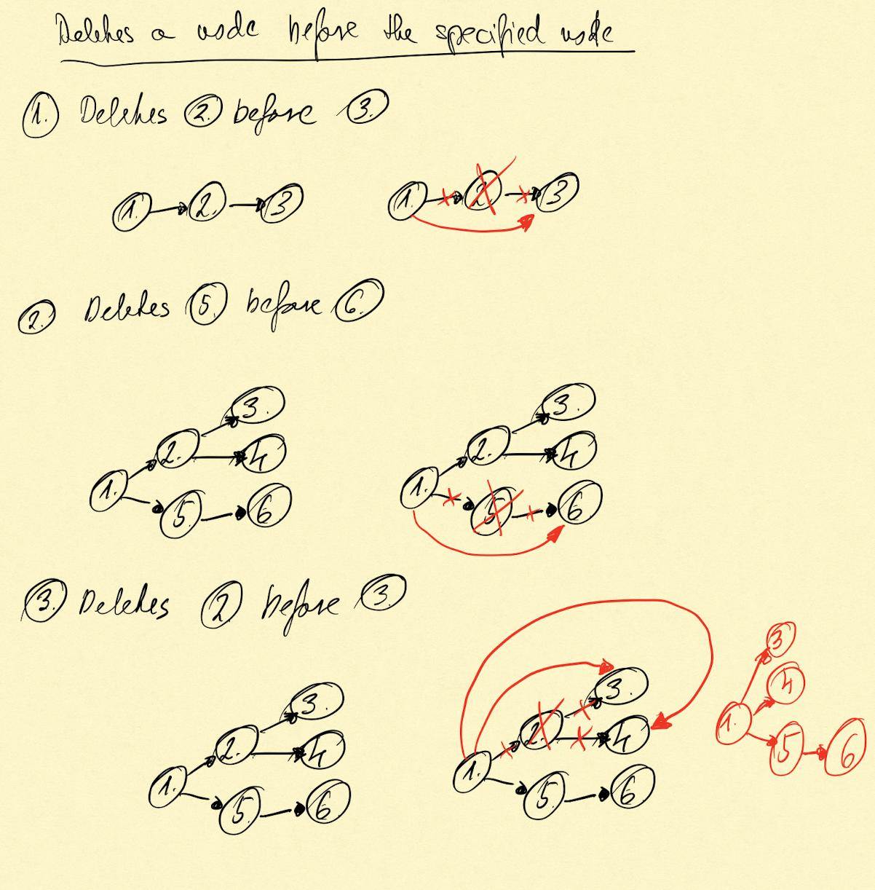
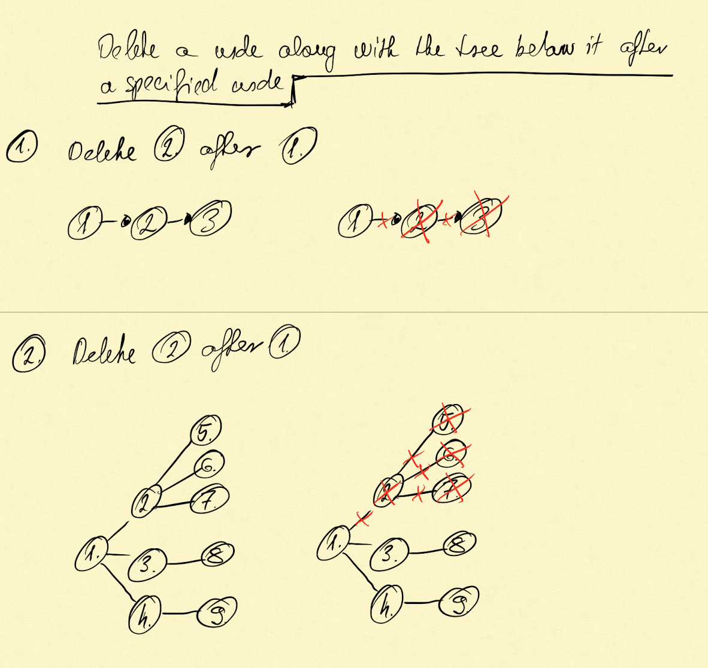
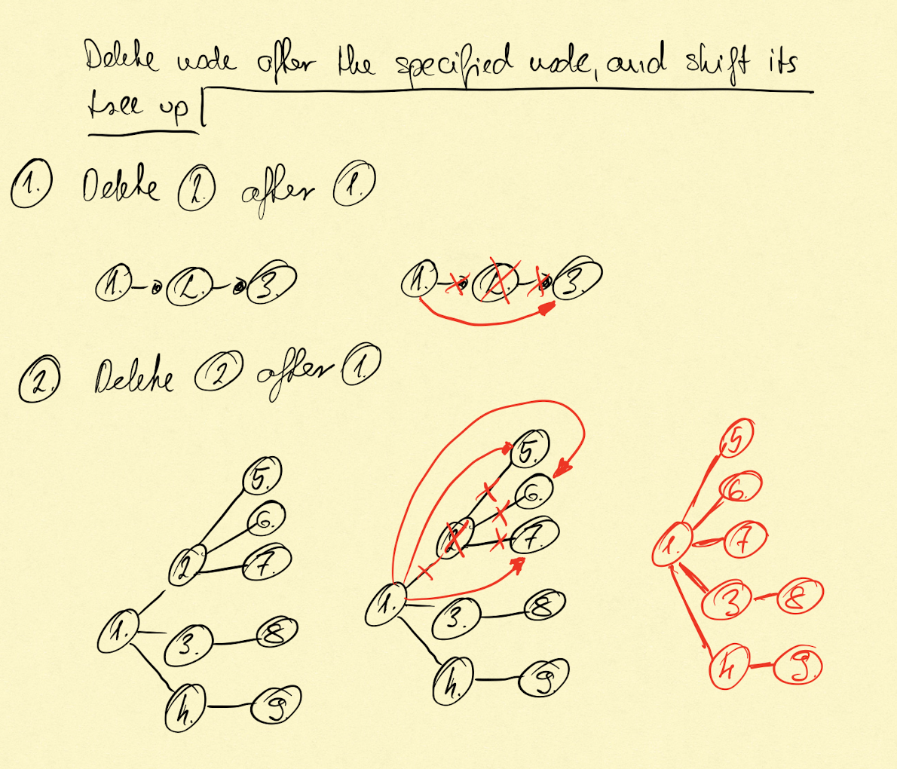

# SourceFormat

SourceFormat describes a document structure. Documents can be described as trees. SourceFormat has
its own way to do so. The point of having a data structure describing any document structure is
providing an opportunity to create structures to any document the system would like to process.

The other field where a custom data structure can be used processing input data is cases where we
have input for a certain domain like addresses, but the address as field changes countries by
countries in its details. By describing UK, German, Hungarian and so on addresses and feed this
information to a form builder it is easy to manage these input tasks. This way we can provide data
type precision instead of manage details as text and having difficulties when these details needed
in further processing.

SourceFormat consists of:

- `SourceFormat`
- `DimensionStructureNode`

## SourceFormat

It contains the metadata about SourceFormat, like a unique identifier, `Name`, `Description` where
additional information can be provided, `url` which points to the source of the data.

## DimensionStructureNode

This one describes the structure portion of a document structure. It provides a tree where the nodes
can contains other, not structure related, information about a document structure. Such
as, `pattern` which describes where a new structural elem starts.

In order to manage easily that a document has structure, information belongs to a structural part
and display properties I had to split these. `DimensionStructureNode` is responsible for describing
structure.

It is a tree structure.

## Structure

```text
- SourceFormat
  -> RootDimensionStructureNode
    -> DimensionStructureNode (tree)
```

## Functionalities

### SourceFormat

- Create
- Delete
- Modify
- List
- Add Root DimensionStructureNode
- Delete Root DimensionStructureNode

### DimensionStructureNode

A node exists if it has a connection to another node, or a `SourceFormat` if the node is a
root `DimensionStructureNode`, in any other cases the node will be deleted. The reason is that a
node itself doesn't have any information because it cannot describe a structural element of a
document. Relationship between nodes contains the structural information we are storing by nodes.

As a result there is no such operation which only creates node. The node relation to other node
or `SourceFormat` has to be specified. This way we want to avoid that orphan node entries polluting
the database.

Every operation requires either a parent or a children in order to locate the item. The other aspect
of defining the item at least one of its connections, is that it helps check whether what is known
by the one who initiates the command (displayed in the UI) and that is stored in the database are in
match.

#### Create and insert a node before a specified node

Creates and inserts a node before the specified node. Insert always pushes the tree down.



#### Create and insert a node after a specified node

Creates and inserts a node after the specified node. This operation always adds the new items as
child to the specified one, as a result the tree is always extended.



#### Delete a node from the tree before the specified node

Deletes a node from the system and removes it from the tree. The specified item and the tree below
it shifts one level up.



#### Delete a node with the tree below it after the specified node

Deletes a node after the specified node. Delete includes also the tree below the node going to be
deleted.



#### Delete a node and shift its tree up, after the specified node

Deletes a node after the specified node. The tree, if there is any, belongs to the deleted node will
be shift up.



#### Update a node
Updates a node with new data.

#### List nodes
Returns all node in the system.

#### List nodes under a specified SourceFormat
Returns list of nodes under the specified `SourceFormat`.

#### List nodes under a specified node
Returns a list of nodes under the specified `DimensionStructureNode`.

#### Find a node
Returns with the node.

#### Get a node with its parent
#### Get a node with its children
#### Get a node with its parent and children
#### Get the tree of a SourceFormat
#### Get the tree from a certain node
#### Delete orphan items
#### List orphan items